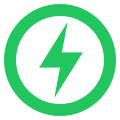
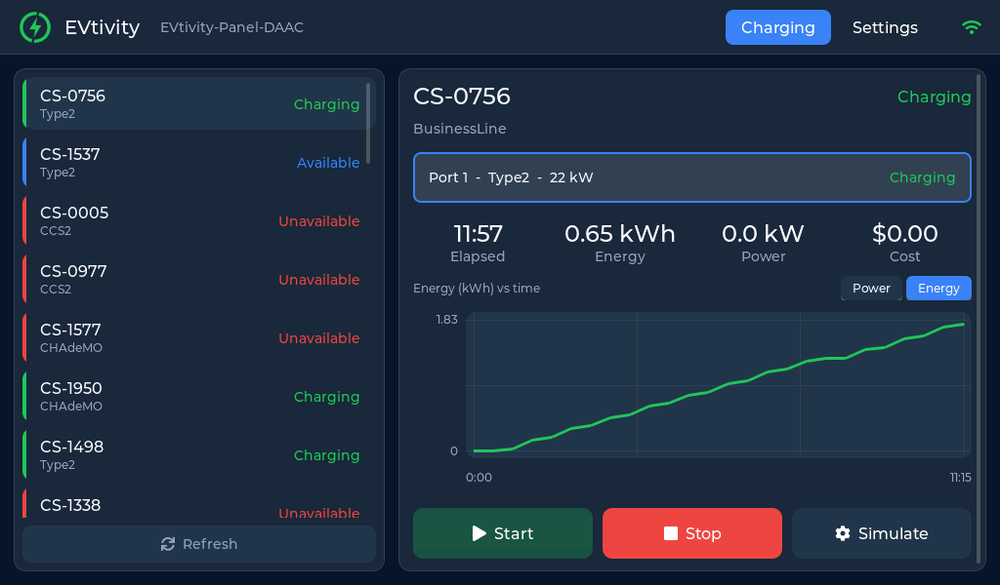
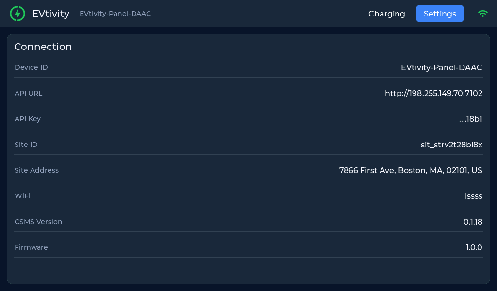

  
  
  
  
  

# EVtivity CSMS IoT Panel

A WiFi touch-screen control panel for the [EVtivity CSMS](https://evtivity.com), built on the Waveshare ESP32-S3-Touch-LCD-7B (7-inch, 1024x600). The panel provisions itself over a self-hosted WiFi access point, connects to a CSMS deployment with an operator API key, and gives on-site staff a clean two-view interface to monitor and control the charging stations at one site.

This repository holds the portable LVGL UI, the Arduino firmware, and a host simulator that renders the UI to pixel-true PNGs. The 7B panel is driven with Waveshare's own 7B drivers; it is not supported by `ESP32_Display_Panel`.

## Screenshots

| Charging | Settings |
| --- | --- |
|  |  |

## What it does

- Exposes a setup access point on first boot. A phone or laptop joins it and opens a captive portal to enter the WiFi credentials plus the CSMS base URL, operator API key, and site ID.
- After provisioning, it connects to the WiFi network and the CSMS REST API.
- Shows two on-screen views:
  - **Charging** lists every station at the configured site with live status, and lets the operator start and stop charging, clear faults, and drive the built-in simulator.
  - **Settings** edits the connection configuration and device preferences, and runs maintenance actions (reconnect, reboot, factory reset).

### Start charging requires free vend

Start uses the guest charging flow (`POST /v1/portal/guest/start/{stationId}/{evseId}`), the same endpoint the driver portal uses. The CSMS opens a guest session with a unique token and sends RequestStartTransaction, so the session passes the payment gate and there is no concurrent-token conflict.

This currently works only on a site with **free vend enabled**. On a paid tariff the endpoint returns `PAYMENT_METHOD_REQUIRED` (a guest needs a card the panel cannot supply), and the panel shows that error. Enable free vend on the site (CSMS: Site Detail > Free Vend) before starting from the panel.

## Setup (AP mode)

The panel provisions over its own WiFi access point, so no cable or app is needed.

1. Power on the panel. While unprovisioned it brings up an open access point named `EVtivity-Panel-XXXX` (the suffix is unique per device and shown on the provisioning screen).
2. Join that network from a phone or laptop. The captive portal opens automatically; if it does not, browse to `http://192.168.4.1`.
3. Sign in to the setup portal (default `admin` / `admin123`) and enter the WiFi credentials, CSMS base URL, operator API key, and site ID.
4. Save. The panel reboots, connects to your WiFi and the CSMS, and switches to the Charging view.

The access point stays up alongside the WiFi connection, so `http://192.168.4.1` remains reachable to change settings later. You can also edit the connection from the on-screen Settings view.

## Hardware

Waveshare ESP32-S3-Touch-LCD-7B: ESP32-S3 (16 MB flash, 8 MB PSRAM), 1024x600 IPS RGB panel, GT911 5-point capacitive touch, a register-based I2C IO expander at 0x24 (not a CH422G), 2.4 GHz WiFi.

- Buy: https://www.amazon.com/dp/B0FDQXKFJ5
- Board repo (7B): https://github.com/waveshareteam/ESP32-S3-Touch-LCD-7B
- Wiki: https://www.waveshare.com/wiki/ESP32-S3-Touch-LCD-7B

The 7B is a different board from the non-B "7" (1024x600 vs 800x480, and a different IO expander), so it is not covered by `ESP32_Display_Panel`. The full, verified pinout, timing, and the display bring-up are in [docs/HARDWARE-7B.md](docs/HARDWARE-7B.md). Board build settings are in [docs/BUILD.md](docs/BUILD.md).

## License

MIT. No credentials are stored in this repository. The panel keeps its WiFi password, API key, and site ID only in the device NVS, entered through the provisioning portal.
